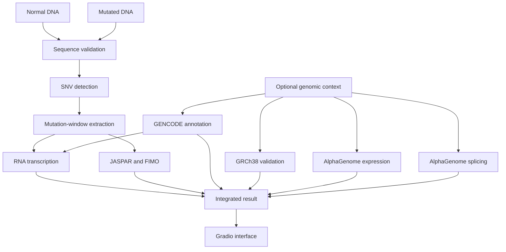

# DNA Mutation Analyzer

A complete computational pipeline for comparing a normal DNA sequence with a mutated DNA sequence and predicting the possible effects of the mutation on:

* DNA sequence structure
* RNA transcription
* Genomic context
* Gene expression
* RNA splicing
* Transcription-factor motif matching

The project combines local sequence-processing methods with **GENCODE**, **GRCh38**, **AlphaGenome**, **JASPAR**, and **FIMO**, and provides an interactive **Gradio** interface.

> **Important:** This project is intended for educational and research purposes only. It is not a medical diagnostic tool.

---

## Project Overview

The main inputs are:

1. A normal or reference DNA sequence
2. A mutated DNA sequence

The project validates the sequences, detects the mutation, and then runs the selected analyses.

The genomic coordinates, gene name, tissue, and strand are optional contextual inputs. They enable advanced analyses such as genomic annotation, gene-expression prediction, and splicing prediction.

---

## Main Features

### DNA Mutation Detection

The project:

* Cleans and validates DNA sequences
* Supports the bases `A`, `C`, `G`, and `T`
* Detects one single-nucleotide variant, or SNV
* Reports the reference and alternate bases
* Reports the mutation position using zero-based and one-based coordinates
* Extracts a sequence window around the mutation

### RNA Transcription

The project converts genomic DNA into RNA while considering the gene strand.

For genes on the reverse strand, it:

1. Calculates the reverse complement
2. Converts thymine `T` to uracil `U`
3. Reports the RNA-level base change

The current RNA output represents direct genomic transcription and should not be interpreted as fully processed mature mRNA.

### Genomic Annotation

Using a local GENCODE annotation database, the project identifies:

* Gene ID
* Gene name
* Gene type
* Gene strand
* Transcription start site
* Distance from the variant to the TSS
* Exon and transcript information
* Promoter regions
* Intronic regions
* Exonic regions
* Coding regions
* UTR regions
* Splice-associated regions

When the user-provided strand conflicts with GENCODE, the project uses the GENCODE strand and generates a warning.

### GRCh38 Reference Validation

The project can verify a genomic variant against a local GRCh38 reference FASTA file.

It can:

* Retrieve the reference nucleotide at a genomic position
* Extract a real sequence window around the mutation
* Verify that the supplied REF allele matches GRCh38
* Generate the corresponding mutated sequence automatically

This functionality is optional because the main project inputs remain the normal and mutated DNA sequences.

### Gene-Expression Prediction

The project uses **AlphaGenome** to compare predicted RNA-seq signals between the reference and alternate alleles.

The output includes:

* Target gene
* Tissue query
* Number of matched tracks
* Strongest biosample
* Raw score
* Quantile score
* Predicted direction:

  * `predicted_increase`
  * `predicted_decrease`
  * `no_directional_change`

The raw score is a computational REF-versus-ALT prediction and is not a laboratory measurement.

### RNA Splicing Prediction

The project combines three AlphaGenome splicing outputs:

* `SPLICE_SITES`
* `SPLICE_SITE_USAGE`
* `SPLICE_JUNCTIONS`

The merged score is calculated as:

```text
merged_splicing_score =
    splice_sites
    + splice_site_usage
    + splice_junctions / 5
```

The result includes:

* Splice-site effect
* Splice-site usage effect
* Splice-junction effect
* Merged splicing score
* Strongest records associated with the target gene

These values are computational predictions and do not directly prove that a specific splicing event occurs biologically.

### Transcription-Factor Motif Analysis

The project uses:

* **JASPAR CORE** motif profiles
* **FIMO** from MEME Suite

FIMO searches both the normal and mutated DNA sequences for motif matches.

The project compares motif sites overlapping the mutation and classifies them as:

* `gained`
* `lost`
* `strengthened`
* `weakened`
* `unchanged`

A gained or lost site means that the motif match crossed the selected FIMO statistical threshold. It does not directly demonstrate protein binding inside a living cell.

### Interactive Gradio Interface

The Gradio application allows users to:

* Enter normal DNA
* Enter mutated DNA
* Select sequence-only or genomic-context analysis
* Provide optional genomic information
* Run AlphaGenome expression analysis
* Run AlphaGenome splicing analysis
* Run JASPAR/FIMO motif analysis
* Inspect each result in a separate tab
* View the complete pipeline output

---

## Analysis Modes

### Sequence-Only Mode

Required inputs:

* Normal DNA sequence
* Mutated DNA sequence

Optional input:

* Gene strand

Available analyses:

* DNA validation
* Mutation detection
* Mutation-window extraction
* Direct RNA transcription when the strand is known
* JASPAR/FIMO motif analysis

### Genomic-Context Mode

Required inputs:

* Normal DNA sequence
* Mutated DNA sequence
* Chromosome
* Genomic position
* Gene name
* Tissue

Optional input:

* Gene strand

Additional analyses:

* GENCODE annotation
* Automatic strand resolution
* AlphaGenome expression prediction
* AlphaGenome splicing prediction
* GRCh38 reference validation

---

## System Architecture



---

## Project Structure

```text
dna-mutation-analyzer/
├── app.py
├── requirements.txt
├── requirements-lock.txt
├── .env.example
├── .gitignore
│
├── data/
│   ├── annotations/
│   ├── motifs/
│   ├── reference/
│   └── tf_binding/
│
├── outputs/
│
├── scripts/
│   ├── build_annotation_db.py
│   ├── compare_tf_binding.py
│   ├── run_alphagenome_expression.py
│   ├── run_alphagenome_splicing.py
│   └── verify_reference_variant.py
│
├── src/
│   ├── annotation/
│   │   ├── database.py
│   │   └── genomic_annotator.py
│   │
│   ├── models/
│   │   └── alphagenome_client.py
│   │
│   ├── pipeline/
│   │   └── analysis_pipeline.py
│   │
│   ├── preprocessing/
│   │   ├── mutation_detector.py
│   │   ├── pipeline.py
│   │   ├── sequence_validator.py
│   │   └── window_extractor.py
│   │
│   ├── reference/
│   │   └── reference_genome.py
│   │
│   ├── reporting/
│   │   └── analysis_report.py
│   │
│   ├── rna/
│   │   └── transcription.py
│   │
│   ├── schemas/
│   │   └── variant_input.py
│   │
│   ├── tf_binding/
│   │   ├── analysis.py
│   │   ├── fimo_parser.py
│   │   ├── fimo_runner.py
│   │   └── motif_comparator.py
│   │
│   └── ui/
│       └── analysis_service.py
│
└── tests/
```

---

## Requirements

### Python

The project was developed using:

```text
Python 3.10
```

Python 3.10–3.13 is recommended because of AlphaGenome compatibility.

### External Programs

The TF motif analysis requires:

```text
MEME Suite
FIMO
```

FIMO is an external command-line program and is not installed through `pip`.

---

## Installation

### 1. Clone the Repository

```bash
git clone <YOUR_REPOSITORY_URL>
cd dna-mutation-analyzer
```

### 2. Create a Virtual Environment

```bash
python3.10 -m venv .venv
```

Activate it using Bash or Zsh:

```bash
source .venv/bin/activate
```

For Fish shell:

```fish
source .venv/bin/activate.fish
```

### 3. Install Python Dependencies

```bash
python -m pip install --upgrade pip
python -m pip install -r requirements.txt
```

For a fully reproducible environment:

```bash
python -m pip install -r requirements-lock.txt
```

---

## AlphaGenome API Configuration

Create a local `.env` file:

```bash
cp .env.example .env
```

Add the AlphaGenome API key:

```env
ALPHAGENOME_API_KEY=your_api_key_here
```

Never commit `.env` to GitHub.

Verify that it is ignored:

```bash
git check-ignore .env
```

---

## Installing FIMO on CachyOS or Arch Linux

Install the build requirements:

```bash
sudo pacman -S --needed \
    base-devel \
    perl \
    python \
    ghostscript \
    curl \
    tar \
    expat
```

CachyOS may use `zlib-ng-compat` instead of the traditional `zlib` package. Do not remove it if other system packages depend on it.

Download and build MEME Suite:

```bash
cd ~/Downloads

curl -L \
  https://meme-suite.org/meme/meme-software/5.5.9/meme-5.5.9.tar.gz \
  -o meme-5.5.9.tar.gz

tar -xzf meme-5.5.9.tar.gz
cd meme-5.5.9

./configure \
    --prefix="$HOME/.local/meme" \
    --enable-build-libxml2 \
    --enable-build-libxslt

make -j"$(nproc)"
make test
make install
```

Some optional MEME Suite tools may fail their tests on rolling-release distributions. The project specifically requires FIMO, so verify its tests and executable directly.

For Fish shell:

```fish
fish_add_path "$HOME/.local/meme/bin"
fish_add_path "$HOME/.local/meme/libexec/meme-5.5.9"
```

Verify FIMO:

```bash
fimo --version
```

Verify that Python can find it:

```bash
python -c "
import shutil
path = shutil.which('fimo')
print('FIMO path:', path)
assert path is not None
"
```

---

## Preparing the GENCODE Annotation Database

Create the annotation directory:

```bash
mkdir -p data/annotations
```

Download the GENCODE basic annotation GTF for GRCh38 and place it at:

```text
data/annotations/gencode.v50.basic.annotation.gtf
```

A compressed file can be decompressed using:

```bash
gzip -dk data/annotations/gencode.v50.basic.annotation.gtf.gz
```

Build the local `gffutils` database:

```bash
python -m scripts.build_annotation_db
```

The expected database path is:

```text
data/annotations/gencode.v50.basic.annotation.db
```

The generated database is large and should not be committed to Git.

---

## Preparing the GRCh38 Reference Genome

Create the reference directory:

```bash
mkdir -p data/reference
```

Download the GENCODE GRCh38 primary-assembly FASTA:

```bash
curl -L \
  https://ftp.ebi.ac.uk/pub/databases/gencode/Gencode_human/release_50/GRCh38.primary_assembly.genome.fa.gz \
  -o data/reference/GRCh38.primary_assembly.genome.fa.gz
```

Decompress it:

```bash
gzip -dk data/reference/GRCh38.primary_assembly.genome.fa.gz
```

The expected path is:

```text
data/reference/GRCh38.primary_assembly.genome.fa
```

The first reference query creates a `.fai` index automatically.

Verify the APOL4 example:

```bash
python -m scripts.verify_reference_variant
```

---

## Preparing the JASPAR Motif Database

Create the motif directory:

```bash
mkdir -p data/motifs
```

Download the JASPAR CORE vertebrate database in MEME format:

```bash
curl -L \
  https://jaspar.elixir.no/download/data/2026/CORE/JASPAR2026_CORE_vertebrates_non-redundant_pfms_meme.txt \
  -o data/motifs/JASPAR2026_CORE_vertebrates.meme
```

Verify the file:

```bash
head -n 12 data/motifs/JASPAR2026_CORE_vertebrates.meme
```

Count the motifs:

```bash
grep -c "^MOTIF " \
  data/motifs/JASPAR2026_CORE_vertebrates.meme
```

The motif database should not be committed because it can be downloaded from JASPAR.

---

## Running the Tests

Run the complete test suite:

```bash
python -m pytest -q
```

Run tests with detailed output:

```bash
python -m pytest -v
```

The project contains more than 100 automated tests covering:

* Sequence validation
* Mutation detection
* Mutation-window extraction
* RNA transcription
* Strand handling
* Variant-input validation
* GRCh38 reference access
* GENCODE annotation
* AlphaGenome helper functions
* Expression analysis
* Splicing analysis
* FIMO parsing
* FIMO execution
* TF motif comparison
* Pipeline integration
* Gradio service functions

---

## Running the Application

Start the Gradio interface:

```bash
python app.py
```

The application normally opens at:

```text
http://127.0.0.1:7860
```

For development with automatic reload:

```bash
gradio app.py
```

---

## Using the Interface

### Sequence-Only Analysis

Enter:

* Normal DNA
* Mutated DNA
* Optional strand

Then select:

```text
Sequence only
```

TF motif analysis can run directly from the supplied sequences.

### Genomic Analysis

Enter:

* Normal DNA
* Mutated DNA
* Chromosome
* Genomic position
* Gene name
* Tissue
* Optional strand

Then select:

```text
Genomic context
```

Enable the required analyses:

* AlphaGenome expression
* AlphaGenome splicing
* JASPAR/FIMO TF motifs

---

## APOL4 Example

### Variant

```text
Chromosome: chr22
Position: 36201698
REF: A
ALT: C
Gene: APOL4
Tissue: colon
Gene strand: -
```

### Real GRCh38 Sequence Window

```text
Reference DNA: GACTCACCCGA
Mutated DNA:   GACTCCCCCGA
                     ^
                    A>C
```

### Genomic Annotation

```text
Gene: APOL4
Gene type: protein_coding
Region: splice_region
Additional region: intron
Strand: -
```

### RNA Change

Because APOL4 is on the reverse strand, the genomic `A>C` mutation appears as an RNA-oriented:

```text
U>G
```

Example direct RNA transcription:

```text
Reference RNA: UCGGGUGAGUC
Mutated RNA:   UCGGGGGAGUC
```

### Expression Prediction

Example AlphaGenome result:

```text
Direction: predicted_decrease
Target gene: APOL4
Tissue query: colon
Matched tracks: 8
Strongest biosample: sigmoid colon
Raw score: approximately -1.9386
```

All eight matched colon-associated tracks in the development example showed negative raw scores.

### Splicing Prediction

Example merged splicing result:

```text
Splice sites:       0.9726
Splice-site usage:  0.8632
Splice junctions:   7.46875
Merged score:       3.3296
```

The strongest splice-site record was associated with a donor site.

The merged score is calculated across AlphaGenome tracks and should not automatically be interpreted as tissue-specific.

### TF Motif Prediction

Using a 101-base sequence window and a FIMO threshold of:

```text
p-value < 1e-4
```

The example produced:

```text
Total FIMO hits: 49
Reference hits: 23
Mutated hits: 26
```

Motif changes overlapping the mutation:

```text
Gained: 4
Lost: 1
```

Gained motif matches:

```text
ZNF460
ZNF606
ZNF135
Wt1
```

Lost motif match:

```text
SREBF1
```

These results describe sequence-to-motif matching and do not prove actual transcription-factor binding.

---

## Python Usage Example

```python
from pprint import pprint

from src.pipeline.analysis_pipeline import run_analysis_pipeline
from src.schemas.variant_input import VariantInput


variant = VariantInput(
    analysis_mode="genomic",
    reference_sequence="GACTCACCCGA",
    mutated_sequence="GACTCCCCCGA",
    chromosome="chr22",
    genomic_position=36201698,
    gene_name="APOL4",
    tissue="colon",
    strand="-",
    flank_size=5,
)

result = run_analysis_pipeline(
    variant=variant,
    annotation_database_path=(
        "data/annotations/"
        "gencode.v50.basic.annotation.db"
    ),
    run_expression_analysis=True,
    run_splicing_analysis=True,
    run_tf_binding_analysis=True,
    motif_database_path=(
        "data/motifs/"
        "JASPAR2026_CORE_vertebrates.meme"
    ),
)

pprint(result)
```

---

## Main Pipeline Output

The complete result may contain:

```text
project_version
analysis_status
preprocessing
genomic_annotation
rna_analysis
expression_analysis
splicing_analysis
tf_binding_analysis
warnings
scientific_notes
final_report
```

Each optional analysis includes a status field such as:

```text
completed
not_run
failed
```

---

## Scientific Interpretation

### AlphaGenome Raw Scores

AlphaGenome scores compare computational predictions for the alternate and reference alleles.

A negative gene-expression raw score suggests a predicted decrease, while a positive score suggests a predicted increase.

These values should not be interpreted as laboratory percentages, disease probabilities, or clinical confidence scores.

### AlphaGenome Quantile Scores

Quantile scores describe how extreme a prediction is relative to a model-specific score distribution.

They are not probabilities.

### FIMO p-values and q-values

FIMO reports:

* A motif score
* A p-value
* A q-value when available
* The matched sequence
* The strand and sequence position

A site classified as gained or lost depends on the selected threshold.

### Tissue Context

The gene-expression output can be filtered using a tissue query.

The official merged splicing score may select the strongest result across available tracks, so its strongest record may belong to a different tissue than the tissue entered by the user.

---

## Limitations

The current MVP has several limitations:

* It supports one SNV per sequence pair.
* The reference and mutated sequences must have equal lengths.
* Insertions and deletions are not currently supported.
* The direct RNA result is not guaranteed to represent mature mRNA.
* Genomic analyses currently focus on the human GRCh38 genome.
* AlphaGenome analyses require genomic coordinates.
* AlphaGenome requires internet access and a valid API key.
* FIMO predicts motif matches rather than direct biological binding.
* GENCODE annotation depends on the selected annotation release.
* Results may vary when model, motif, or annotation databases are updated.
* The project does not perform clinical variant classification.
* The project does not replace experimental validation.

---

## Data and Security

The following files must not be committed:

```text
.env
.venv/
data/reference/*.fa
data/reference/*.fa.gz
data/reference/*.fai
data/annotations/*.db
data/annotations/*.gtf
data/annotations/*.gtf.gz
data/motifs/*.meme
outputs/
```

Before pushing changes, verify:

```bash
git status
git check-ignore .env
```

Never publish the AlphaGenome API key.

---

## Reproducibility

Use the locked dependency file:

```bash
python -m pip install -r requirements-lock.txt
```

Record the following when reporting an experiment:

* Project commit or Git tag
* Python version
* AlphaGenome package version
* GENCODE release
* GRCh38 reference release
* JASPAR release
* MEME Suite and FIMO version
* FIMO threshold
* Sequence-window size
* Target gene and tissue

---

## Current Project Status

```text
DNA preprocessing             Complete
SNV detection                 Complete
RNA transcription             Complete
GENCODE annotation            Complete
GRCh38 validation             Complete
AlphaGenome expression        Complete
AlphaGenome splicing          Complete
JASPAR/FIMO analysis          Complete
Pipeline integration          Complete
Automated tests               Complete
Gradio interface              Complete
```

The project is currently considered a complete research and educational MVP.

---

## Future Improvements

Possible future improvements include:

* Insertion and deletion support
* Multiple-variant analysis
* Automatic GRCh38 sequence extraction from genomic inputs
* Tissue-specific splicing summaries
* Detailed splice-junction visualization
* Motif score plots
* DNA and RNA sequence highlighting
* Downloadable PDF or HTML reports
* Batch variant analysis
* VCF-file input
* Local caching of AlphaGenome results
* Additional sequence-model baselines such as DNABERT-2
* Carbon sequence-likelihood analysis
* Deployment using Docker
* Authentication and user-result history

---

## Disclaimer

This software provides computational predictions for educational and research use.

It must not be used as the sole basis for:

* Medical diagnosis
* Treatment decisions
* Genetic counseling
* Clinical variant classification
* Patient-risk estimation

All important conclusions should be reviewed by qualified specialists and validated using experimental or clinical evidence.

---

## Author

**Muhammad Qasem Alsehhoum**

AI and Machine Learning Developer

Main areas:

* Machine Learning
* Deep Learning
* Natural Language Processing
* Computer Vision
* Bioinformatics and genomic AI

---

## Acknowledgements

This project uses or integrates resources from:

* AlphaGenome
* GENCODE
* GRCh38
* JASPAR
* MEME Suite and FIMO
* Gradio
* Biopython
* pandas
* Pydantic
* gffutils
* pyfaidx
* pytest

---

## License

No license is currently declared.

Before public redistribution or external contribution, add an appropriate `LICENSE` file and update this section.
